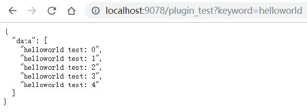
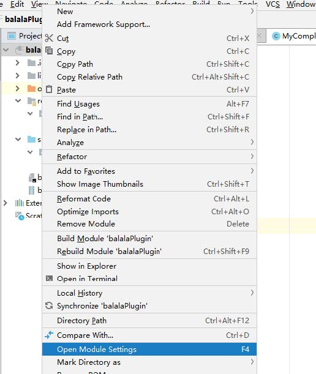
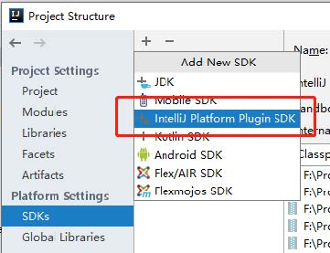
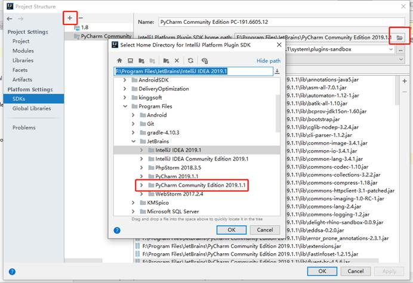

# AI-Coder
AI-Coder是一种基于PyCharm的代码句补全插件。

- backend——代码句补全服务器
- dataset——训练数据集
- model——代码句补全模型
- plugin——插件开发配置

## 服务器
代码句补全服务器尝试了两种框架，分别是Flask和Crow。
### Flask

#### 1. 准备

如果没有安装 flask，先安装 flask。anaconda 自带了 flask。
`pip install flask`

#### 2. 运行

进入 backend 文件夹，运行 server_demo.py。

在浏览器中输入 localhost:9078/plugin_test?keyword=helloworld ，浏览器返回内容如下。

后端获取 keyword 中的数据，处理之后返回。后续我们使用模型处理输入，道理是一样的。

### [Crow](https://github.com/ipkn/crow)
Crow是一个轻量级的Web服务器框架，这个框架是受Python下的Flask启发的，其实现的功能和Flask基本一致，核心的区别在于Crow是用C++编写的，性能较Flask有一定的提升。

## 数据集
数据集有两个，第一个是Keras领域的代码数据，第二个是TensorFlow领域的代码数据。  

代码数据中均删除了参数。

## 模型
### 深度学习环境

模型训练环境包含两种：
#### tensorflow 1
- python 3.5
- tensorflow 1.13.1
- keras 2.2.4

#### tensorflow 2
- python 3.7
- tensorflow 2.2

从模型代码的文件名中可以得知对应的版本号，例如：
> Text_Gen_tf10.ipynb  

表示该代码文件为生成模型，使用的版本为tensorflow 1的版本

### 模型介绍
模型尝试了三种，分别是：
- 基于长短期记忆的代码句生成模型
- 基于序列到序列的代码句预测模型
- 基于Transformer的代码句预测模型  

  
  
注：模型文件类型为ipynb，需要用jupyter打开。

## 插件

### 1. 准备

- 开发插件所用的编辑器——IDEA 测试时使用版本 IntelliJ IDEA 2019.1 x64

- 插件适用对象——Pycharm 测试时使用版本 JetBrains PyCharm Community Edition 2019.1.1 x64

注：Pycharm必须安装社区版！否则不能调试。

### 2. 插件项目的导入与运行

打开IDEA,File->open->我们项目的根目录

然后需要配置：

1) 在IDEA中选择项目根目录右键Open module settings

设置项目的SDK为本机安装的Pycharm社区版，新建一个SDK，路径选择为安装的pycharm社区版根目录

2) 运行项目时会启动一个Pycahrm 窗口，是带有我们这个插件效果的。

